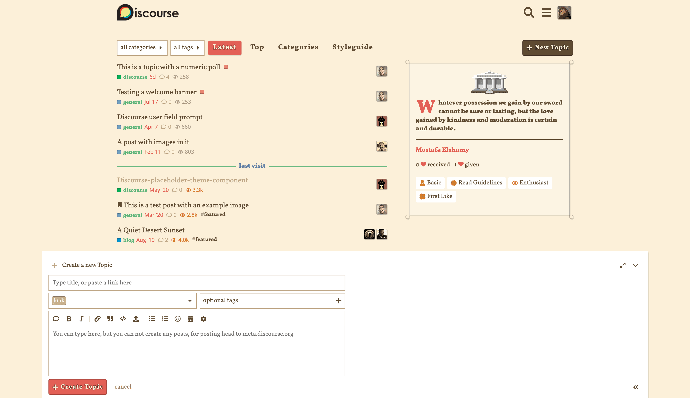

# Rome

Rome is a light Discourse theme that feels like an ancient roman manuscript and uses color based on pigments available to an artist of the time.

[Mood](https://artsandculture.google.com/asset/sentences-folio-171r/qQG2t8pfqY2WQQ)
